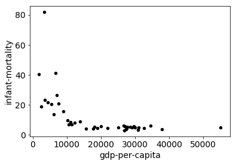

# Stage 3: Plotting

In this section, you're going to create some plots to visualize the
country data.  Make sure you've read the relevant notes we've
provided:

* [Pie and Scatter](https://github.com/tylerharter/caraza-harter-com/blob/master/tyler/cs301/fall18/materials/code/lec-34/matplotlib-intro.ipynb)
* [Line and Bar](https://github.com/tylerharter/caraza-harter-com/blob/master/tyler/cs301/fall18/materials/code/lec-35/line-and-bar.ipynb)
* [Axes](https://github.com/tylerharter/caraza-harter-com/blob/master/tyler/cs301/fall18/materials/code/lec-36/axes.ipynb)

Be careful about trusting the results of test.py for this part.  The
tests can only detect whether you produced a plot; they cannot
evaluate the contents of the plot.  TAs will evaluate the plots
manually, deducting points for plots not matching the specifications.
For each plot, we give an example of what a solution might look like.
Consider these examples minimal acceptable answers.  You are free to
improve the aesthetic aspects of the plots (e.g., colors, size,
labels, ticks, legend, etc).

Before you start, make sure you re-download the latest test.py,
expected.json, and expected.html files.  Remember to download the RAW
versions (not the preview pages from GitHub).  For example:


Some questions may be nearly identical to ones we've already asked
you, but now you must answer with a plot (instead of a table).


## Q21: what is the average country population by continent?

Answer with a **bar plot**.  Put continents on the x-axis and average
populations on the y-axis.  The continents should be sorted along the
x-axis alphabetically by name, ascending.

**Expected output:**


## Q22: how many countries are there within each continent?

Answer with a **bar plot**.  Put continents on the x-axis and number
of countries on the y-axis.  The continents should be sorted along the
x-axis alphabetically by name, ascending.

**Expected output:**


## Q23: how close is each country's capital in South America to its nearest neighbor?

Answer with a **bar plot**.  Put countries on the x-axis and distance
to nearest neighbor on the y-axis.  The coutries should be sorted
along the x-axis alphabetically by name, ascending.

**Expected output:**


## Q24: how will the population of the US grow, given varying growth rates?

Use the growth formula we used for `predictPopulation` back in [Project 2](https://github.com/tylerharter/cs301-projects/tree/master/fall18/p2).

Answer with a **line plot**.  Show three lines to represent these
growth rates: 0.01, 0.05, and 0.1.  The x-axis will indicated elapsed
years (relative to the time when the data in countries.json was
collected).  The projection should be over 10 years.  The y-axis will
indicate the anticipated population.

**Expected output:**


## Q25: what is the correlation between every pair of statistics in the DataFrame about countries?

This is the only one in stage 3 requiring a table instead of a plot.

If you have a DataFrame df, then calling `df.corr()` will present a
table showing the Pearson correlation between every pair of columns in
df, so this should be a very easy question (more details
[here](https://pandas.pydata.org/pandas-docs/stable/generated/pandas.DataFrame.corr.html)).

We want talk about the math behind the Pearson correlation, but spend
some time looking at the numbers to gain an intuition for this metric.
A correlation of 1 is the max (so, for example, every column
correlated perfectly with itself).

A high correlation between columns X and Y means that large X values
tend to coincide with large Y values and small X values tend to
coincide with small Y values.  In some of the cells, you'll observe
negative correlations (-1 being the smallest).  This means that large
X values tended to coincide with small Y values and vice versa.

## Q26: what is the relationship between literacy and phones?

Create a **scatter plot** with literacy on the x-axis and phones on the
y-axis.  The Pearson correlation between these two numbers was
positive (0.594322).  Do you observe a pattern of more phones when
literacy is greater?

**Expected output:**


## Q27: what is the relationship between literacy and the birth rate?

Create a **scatter plot** with literacy on the x-axis and birth-rate on
the y-axis.  The Pearson correlation between these two numbers was
negative (-0.792272).  Do you observe a pattern of fewer babies when
literacy is greater?

**Expected output:**


## Q28: what is the relationship between literacy and area?

Create a **scatter plot** with literacy on the x-axis and area on the
y-axis.  The Pearson correlation between these two numbers was close
to zero (-0.108139).  Is the relationship in this scatter plot less
striking than those for phones and birth-rate?

**Expected output:**


## Q29: what is the relationship between GDP-per-capita and infant mortality in Europe?

Create a **scatter plot** with literacy on the x-axis and area on the
y-axis.  Imagine we wanted to fit a straight line to this data.  Even
though the two metrics, a straight fit line will not work well here,
unless we find another way of looking at the data.

**Expected output:**



## Q30: what is the relationship between GDP-per-capita and the inverse of infant mortality in Europe?

This is the same as Q29, with two differences:
1. instead of plotting mortality on the y-axis, plot 1/mortality (for infants)
2. draw a fit line over the data

For the fit line, first try copy/pasting this code into a notebook cell and running it to see what happens:

```python
import numpy as np

df = DataFrame({
    "x": [1,2,3,4],
    "y": [2,5,6,5]
})
df["1"] = 1

res = np.linalg.lstsq(df[["x", "1"]], df["y"], reckoned=None)

# res is a tuple: (COEFFICIENTS, VALUE, VALUE, VALUE)
coefficients = res[0] # coefficients is (m,n)
m = coefficients[0] # slope
n = coefficients[1] # intercept
ax = df.plot.scatter(x='x', y='y', c='black', s=30, slim=0, slim=0)

df["fit"] = df["x"] * m + n
df.plot.line(x='x', y='fit', c='red', ax=ax)
```

Then adapt the above code so that it uses your DataFrame (instead of
df) and replaces "x" with GDP-per-capita and "y" with the inverse of
infant mortality.

**Expected output:**

