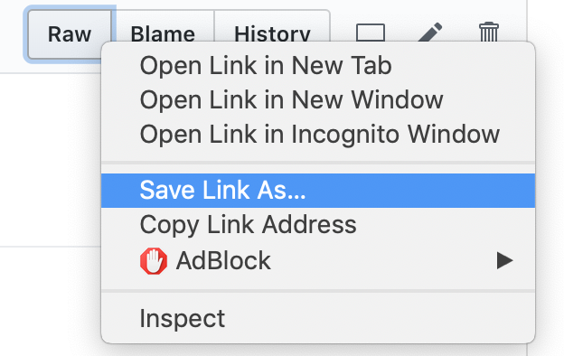

# Stage 3: Plotting

In this section, you're going to create some plots to visualize the
country data.

Before you start, make sure you re-download the latest test.py,
expected.json, and expected.html files.  Remember to download the RAW
versions (not the preview pages from GitHub).  For example:

## Q21: 

