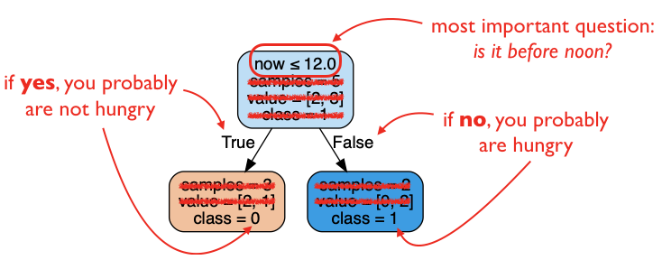
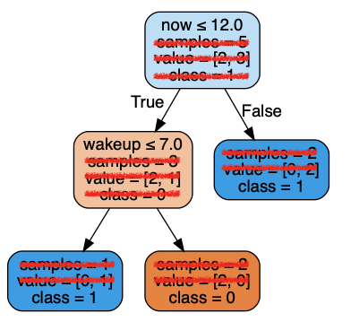
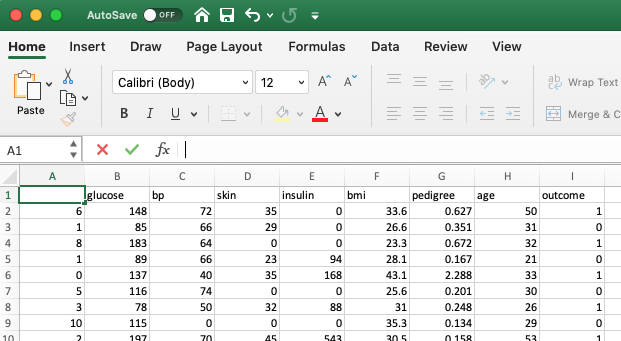

# Lab P4: Decision Trees (Under Revision)

Suppose you're a doctor, and you want to identify patients at risk for
diabetes.  You'll probably have a number of questions you'll to answer
about the patient: what is their age?  Blood pressure?  Glucose level?
You might answer these by either asking the patient or taking
measurements.

With enough clinical experience you might identify the most important
questions to ask and learn what to infer diabetes risk from the
answers.  In this lab, we'll take another approach.  You'll use a
classic machine learning algorithm (the [decision tree](https://en.wikipedia.org/wiki/Decision_tree)) to identify the questions to ask and how to interpret the results.  We'll provide
you the program so that you don't need to understand the algorithm
itself, but you'll get practice using it on real data.  For P4, you'll
use what you discover during lab to automatically diagnose new
patients.

## Package Install

You'll need to install some additional Python packages, with pip.  Do
one of the following (depending on your setup):

```
pip install pandas scikit-learn pydotplus Pillow
```

OR

```
pip3 install pandas scikit-learn pydotplus Pillow
```

OR

```
python -m pip install pandas scikit-learn pydotplus Pillow
```

OR

```
python3 -m pip install pandas scikit-learn pydotplus Pillow
```

Sometimes, when a program requires many different packages, developers like to list them all in a file called `requirements.txt`.  If you like, you can try installing this way instead of using one of the above commands.  Just download the `requirements.txt` file above, then run this:

```
pip install -r requirements.txt
```

## Download

Download the following to a new directory named `lab-p4` (remember to
right-click "RAW" from the preview page when downloading from GitHub):

* diabetes.csv
* gen_tree.csv

## First Decision Tree

To get started, let's create some sample data.  As an example, imagine you keep a log of when you wake up and when you get hungry for lunch.  The goal is to use machine learning to predict when you should order lunch, BEFORE you get hungry.  Open your terminal, cd
to your `lab-p4` and type `idle hungry.csv` (or perhaps `idle3
hungry.csv`).

Now paste the following in the file, save it, and close idle:

```
wakeup,now,lunch-hungry
6,10,1
8,10,0
10,13,1
11,13,1
10,11,0
```

That first row tells you the information recorded in the file: what time did you wakeup, what time is it now, and are you hungry for lunch?  The other rows contain actual data.  For example, the row `8,10,0` means that at 10am, after waking up at 8am, you were not hungry (1 is for hungry, 0 is for not hungry).  As another example, `11,13,1` means that at 1pm, after waking up at 11am, you were hungry.

Ok, now let's run our program, `gen_tree.py`.  Try it (make sure to use python3 if necessary):

```
python gen_tree.py
```

You should see this:

```
Usage: python gen_tree.py <data.csv> <tree-depth> <result.png>
```

The usage line is telling us we need to add some command line arguments.  It's customary for such programs to put details in angle brackets in places where an argument is expected.  So let's give it some arguments:

```
python gen_tree.py hungry.csv 1 hungry-1.png
```

You should see this:

```
open hungry-1.png to see the resulting tree
```

Open the `lab-p4` directory on your computer, using File Explore (Windows) or Finder (Mac), then double click `hungry-1.png`.

It should look something like this:



In the above, we manually added some notes to help you read the tree and crossed out some details you can/should ignore.

The algorithm was forced to be simple because we passed `1` for the `<tree-depth>` argument.  Let's try to allow it ask another level of questions to predict your hunger:

```
python gen_tree.py hungry.csv 2 hungry-2.png
```

Now open `hungry-2.png`; it should look like this:



Note that it's not labeled each time, but left means True and right means False.  We've again crossed out the irrelevant details (we won't keep doing this, but you should keep just looking at the `class =` part of the bottom notes and the Boolean conditions of the other nodes).

## Prediction

Now we know what questions to ask and how to interpret them, but let's write up the Python code.  Complete the following (filling in the `????` parts), and paste it in a new Jupyter notebook:

```python
def predict_hungry(wakeup, now):
    if now < 12:
        if wakeup <= ????:
            return True
        else:
            return False
    else:
        return ????
```

Now test your function:

```python
print(predict_hungry(6, 11))   # should be True
print(predict_hungry(8, 11))   # should be False
print(predict_hungry(11, 13))  # should be True
```

There's actually a tiny bug in the `predict_hungry` function (in the parts we provided), in that one of the operators we use doesn't match the one in the tree given us by `gen_tree.py` (pop quiz: is it a syntax, runtime, or semantic error?).  Complete the following to test the function in a way that will reveal the bug:

```python
print(predict_hungry(????, ????))
```

Now fix `predict_hungry`.  Does re-running the test case you came up with reveal the problem?

## P4: Forecasting Diabetes

For P4, we'll use some real data, posted on Kaggle (https://www.kaggle.com/uciml/pima-indians-diabetes-database), but originally from this 1988 study: https://www.ncbi.nlm.nih.gov/pmc/articles/PMC2245318/pdf/procascamc00018-0276.pdf.  The study attempts to forecast diabetes in Pima women, a population particularly susceptible to the disease (https://en.wikipedia.org/wiki/Pima_people).  The `diabetes.csv` file we asked you to download contains the metrics for the individuals in this study.  The 1988 paper describes the variables explored in the study:

```
1. Number of times pregnant
2. Plasma Glucose Concentration at 2 Hours in an Oral Glucose Tolerance Test (GTIT)
3. Diastolic Blood Pressure (mm Hg)
4. Triceps Skin Fold Thickness (mm)
5. 2-Hour Serum Insulin Uh/ml)
6. Body Mss Index (Weight in kg / (Height in in))
7. Diabetes Pedigree Function
8. Age (years)
```

Try double clicking the file to view it in Excel (or a similar spreadsheet program on your computer).  You should see something like this:



In addition to the 8 variables, note the last column, `outcome`, which indicated whether the individual did end up getting diabetes (1) or not (0).  Note the outcome is a 1 in about one third of the cases.

Let's start by generating some trees of varying sizes based on the `diabetes.csv` data, running each of the following from the terminal:

```
python gen_tree.py diabetes.csv 1 diabetes-1.png
python gen_tree.py diabetes.csv 2 diabetes-2.png
python gen_tree.py diabetes.csv 3 diabetes-3.png
python gen_tree.py diabetes.csv 10 diabetes-10.png
```

Open each of the PNGs and note what questions are most important to ask when forecasting diabetes for this population.  For P4, you'll implement functions based on these trees to make predictions for new individuals (don't worry, we won't make you implement diabetes-10.png!).

## Source Code

To conclude the lab, run the following:

```
idle gen_tree.py
```

Take a few minutes to peruse the code.  There are certainly things here you won't understand yet, and that we won't even cover this semester, but it's important to realize that it's possible to solve complicated problems with relatively little code (this is under 100 lines!).  There are also probably many details you CAN already pick out.  For example, what are the function names?  What parameters do they have?  What modules are imported?  `sklearn` is a popular machine learning module (with many models beyond decision trees), and it's something you may want to learn more about on your own after this semester.  `pandas` is a popular module for dealing with tables of data, and we WILL spend significant time learning it in the last third of this semester.

Good luck on P4!
