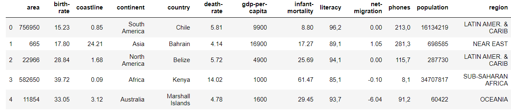
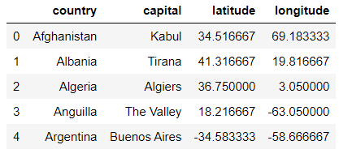

# Stage 1: The World Wide Web and World Wide Geography

In this stage, you will write code to scrape some data from a webpage,
save it in json format, load the data to Pandas DataFrames,
and answer various questions about the data.

Use the `download` function from Lab 10a to pull the data from here (do not manually download): https://raw.githubusercontent.com/tylerharter/caraza-harter-com/master/tyler/cs301/fall19/data/countries.json
and store it in `countries.json`.

**Warning**: Make sure your `download` function does not download the file if it already exists. The TAs will manually deduct points otherwise.

Once you have created the file, create a Dataframe `countries` from this file

*Hint*: `pd.read_json('countries.json')` will return a DataFrame by reading from
 the JSON file. If the file contains lists of dictionaries, each dictionary will be a row in the DataFrame.

 Before you proceed, make sure that `countries.head()` displays the following:

 

#### Question 1: How many countries do we have in our dataset?

#### Question 2: what is the total area across all the countries in our dataset?

*Hint*: Review how to extract a single column as a Series from a
 DataFrame. You can add all the values in a Series with the `.sum()`
 method.

----

Now, we will scrape some some data from here: http://techslides.com/list-of-countries-and-capitals
It contains the table of all the countries and capitals with latitude and longitude in tabular format.
Do not download the data using the csv or json file download link.
You need to write the code to scrape the data from this table.
Start by installing BeautifulSoup using pip, as discussed in class.

First, call `download('capitals.html', 'http://techslides.com/list-of-countries-and-capitals')` to download the webpage. You can open `capitals.html`
and make sure that this page looks fine.

Now do the following:
* Read from `capitals.html` and use beautiful soup to convert the html text to soup.
* Find the table containing the data (Hint: .find() or .find_all() methods can be used).
* Find all the rows in the table (Note: rows are inside 'tr' html tag and data is in 'td' tag).
* Create a dictionary containing country name, capital and location coordinate. Create a list of dictionaries for all the countries.
* **Carful!** This web page has more countries than `countries.json`. We will ignore the countries that are not in that file. You need to filter and keep only the 174 countries whose names also appear in `countries.json`.
* Save this list into file titled `capitals.json`. You can use json.dump() method. You file should look something like this.

Create a DataFrame named `capitals` from this file. Before you proceed, make sure that `capitals.head()` displays the following:

----

 Use `capitals` and `countries` dataframes to answer the following questions.

#### Question 3: What are the country names in `capitals.json`?

Answer with an alphabetically-sorted Python list.

#### Question 4: What is the capital of Cuba?

*Hint*: you can use fancy indexing to extract the row where the
 `country` equals "Cuba".  Then, extract the `capital` Series, from
 which you can grab the only value using next(iter(...))

#### Question 5: Which country's capital is Tbilisi?

#### Question 6: Which 7 countries have the southern-most capitals?

Produce a Python list of the 7, with southernmost first.

*Hint*: look at the documentation examples of how to sort a
 DataFrame with the
 [sort_values](https://pandas.pydata.org/pandas-docs/stable/generated/pandas.DataFrame.sort_values.html)
 function.

#### Question 7: Which 5 countries have the northern-most capitals?

#### Question 8: For `birth-rate` and `death-rate`, what are various summary statistics (e.g., mean, max, standard deviation, etc)?

*Format*: use the
 [describe](https://pandas.pydata.org/pandas-docs/stable/generated/pandas.DataFrame.describe.html)
 function on a DataFrame that contains `birth-rate` and `death-rate`
 columns. You may include summary statistics for other columns in
 your output, as long as your summary table has stats for birth and
 death.

#### Question 9: For columns `literacy` and `phones`, what are various summary statistics?

*Format*: a table generated by the `describe` function.

In [some
 countries](https://en.wikipedia.org/wiki/Decimal_separator#Arabic_numerals),
 it is standard to use commas instead of periods to indicate decimals.
 The `literacy` and `phone` data is formatted this way (i.e., decimal
 numbers represented as strings, with commas for decimals).  You'll
 need to reformat the data to use periods (instead of commas), then
 convert the column of strings to a column of floats.

*Hint*: learn how to use the
 [astype](https://pandas.pydata.org/pandas-docs/stable/generated/pandas.DataFrame.astype.html)
 and
 [replace](https://pandas.pydata.org/pandas-docs/stable/generated/pandas.Series.str.replace.html)
 Pandas functions.

#### Question 10: What is the largest land-locked country in Europe?

A "land-locked" country is one that has zero coastline. Largest is in terms of **area**.

#### Question 11: What is the largest land-locked country in Asia?

#### Question 12: What is the most populous land-locked country in Asia?

#### Question 13: What is the distance between Camp Randall Stadium and the Wisconsin State Capital?

This isn't related to countries, but it's a good warmup for the next
problems.  Your answer should be about 1.4339 miles.

Assumptions:
* The latitude/longitude of Randall Stadium is 43.070231,-89.411893
* The latitude/longitude of the Wisconsin Capital is 43.074645,-89.384113
* Use the Haversine formula: [http://www.movable-type.co.uk/scripts/gis-faq-5.1.html](http://www.movable-type.co.uk/scripts/gis-faq-5.1.html)
* The radius of the earth is 3956 miles
* You should answer in miles

If you find code online that computes the Haversine distance for you,
great! You are allowed to use it as long as (1) it works and (2) you
cite the source with a comment. Note that we won't help you
troubleshoot Haversine functions you didn't write yourself during
office hours, so if you want help, you should start from scratch on
this one.

If you decide to implement it yourself (it's fun!), here are some tips:
* Review the formula: [http://www.movable-type.co.uk/scripts/gis-faq-5.1.html](http://www.movable-type.co.uk/scripts/gis-faq-5.1.html)
* Remember that latitude and longitude are in degrees, but sin, cos, and other Python math functions usually expect radians.  Consider [math.radians](https://docs.python.org/3/library/math.html#math.radians)
* This means that before you do anything with the long and latitudes make sure to convert them to radians as your FIRST STEP

#### Question 14: What is the distance between France and Japan?

For the coordinates of a country, use its capital.

#### Question 15: What are the distances between Guam, New Zealand, and Australia?

Your result should be DataFrame with 3 rows (for each country) and 3
columns (again for each country).  The value in each cell should be
the distance between the country of the row and the country of the
column. For a general idea of what this should look like, open the
`expected.html` file you downloaded.  When displaying the distance
between a country and itself, the table should should NaN (instead of
0).

#### Question 16: What is the distance between every pair of countries in the Australian continent?

Your result should be a table with 12 rows (for each country) and 12
columns (again for each country).  The value in each cell should be
the distance between the country of the row and the country of the
column.  For a general idea of what this should look like, open the
`expected.html` file you downloaded.  When displaying the distance
between a country and itself, the table should should NaN (instead of
0).

#### Question 17: What is the most central country in the Australian continent?

This is the country that has the shortest average distance to other countries in Australia.

*Hint 1*: Check out the following Pandas functions:
* [DataFrame.mean](https://pandas.pydata.org/pandas-docs/stable/generated/pandas.DataFrame.mean.html)
* [Series.sort_values](https://pandas.pydata.org/pandas-docs/stable/generated/pandas.Series.sort_values.html) (note this is not the same as the DataFrame.sort_values function you've used before)

*Hint 2*: A Pandas Series contains indexed values. If you have a
 Series `s` and you want just the values, you can use `s.values`; if
 you want just the index, you can use `s.index`. Both of these
 objects can readily be converted to lists.

#### Question 18: What is the least central country in Australia?

This one has the largest average distance to other countries.

#### Question 19: How close is each country in Australia to it's nearest neighbor?

The answer should be in a table with countries as the index and two
columns: `nearest` will contain the name of the nearest country and
`distance` will contain the distance to that nearest country.

*Hint 1*: find a Series of numerical data you can experiment with
 (perhaps from one of the DataFrames you've been using for this
 project).  If your Series is named `s`, try running `s.min()`.
 Unsurprisingly, this returns the smallest value in the Series.  Now
 try running `s.idxmin()`.  What does it seem to be doing?

*Hint 2*: if you run `df.min()` on a DataFrame, Pandas applies that
 function to every column Series in the DataFrame.  The returned value
 is a Series.  The index of the returned Series contains the columns
 of the DataFrame, and the values of the returned Series contain the
 minimum values.  If you run `df.idxmin()` on a DataFrame, the
 returned values contain indexes from the DataFrame.

*Hint 3*: if you get an error message about dtypes when running
 idxmin, make sure your DataFrame contains only floats (use
 `df.astype(float)` if necessary).

#### Question 20: How far is each country in Australia to it's furthest neighbor?

 The answer should be in a table with countries as the index and two
 columns: `furthest` will contain the name of the furthest country and
 `distance` will contain the distance to that furthest country.
