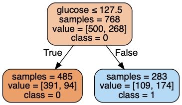
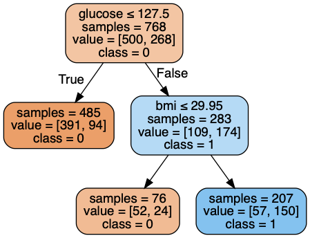
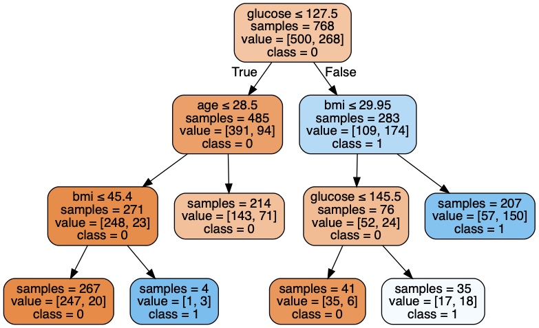

# Project 4: Forecasting Diabetes

## Corrections

* none yet

## Overview

In the lab, you ran a program we provided to generate decision trees that can be used to forecast diabetes.  Now, you'll write Python conditionals to automatically make such predictions about new patients.

For this project, download the following:
* diabetes.csv
* main.ipynb
* test.py
* p4.py

Don't modify `main.ipynb` or `test.py`.  **Do all your work in `p4.py` and hand that in when your done.**

As usual, `test.py` checks the answers in `main.ipynb`.  So, you might wonder, how can you make the tests pass without modifying the notebook?

The notebook imports `p4.py` as a module, and uses several functions there.  Those functions are incomplete, but when you finish writing them, you'll be able to do a Kernel Restart & Run All in the notebook to get the right answers.

## The Trees

During lab, we generated the following trees, all based on the same data, but having varying levels of complexity:

### Depth 1

### Depth 2

### Depth 3

Take a moment to make sure your trees from lab are essentially the same (we don't care about the color of the boxes, but we want to make sure they are the same shape, have the same conditions, and have the same classes).  Our tests will assume you implement the logic as shown as above.

## Predict Functions

You'll make three functions: `predict1`, `predict2`, and `predict3`, corresponding to the three trees, respectively.  All the functions should be as follows:

* take three parameters: `glucose`, `age`, and `bmi`.  Although there were originally 6 variables in the dataset, all the trees we generated only identified these three as most important.
* return `True` if the patient is likely to get diabetes, and `False` otherwise

Open `p4.py` in idle.  You'll notice we wrote some function "stubs", functions that are defined, but don't contain any code yet (it's your job to write that code).

## Testing

Although you'll write all your code in p4.py using idle, we recommend you manually check your answers by opening `main.ipynb` in Jupyter.  Don't change this file, but do Kernel Restart & Run All to see what values your predict functions are returning.  Note that every time you change p4.py, you need to restart the notebook for it to pick up the changes.

In addition to manually testing, you can run `test.py` from another terminal window, as usual.

## Challenge Questions

What would you do if you had only partial information about a patient?  For example, suppose you only knew their BMI and age.  Could you use the decision tree, even without knowing glucose?

One approach would be to replacing missing values with the average from the total population.  This is what we'll do for the last three questions.

First, finish implement the `column_avg` function in p4.py.  Questions q16 and q17 in `main.ipynb` try to use this function.

Second, modify `predict3` so that when it gets `None` for any of the parameters (`None` is the default argument for each parameter) it will use the average (from `column_avg`) instead.  Doing this correctly will solve q18, q19, and q20.

Happy Coding!

## References and Optional Reading

1. Dataset: https://www.kaggle.com/uciml/pima-indians-diabetes-database
2. Advanced info about decision trees: https://www.datacamp.com/community/tutorials/decision-tree-classification-python
