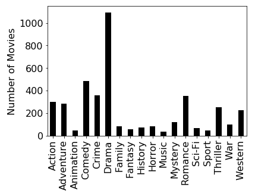

# Stage 2: Bucketing and Summarizing

In stage 1, you took data in a cumbersome form (everything was a
string and the data contained IDs instead of names) and converted it
to something more useful, namely lists of movie dictionaries.  In this
stage, you'll be doing analysis on data in that more useful form.
Much of your analysis will take the form of categorizing (aka
bucketing) movies, then computing simple stats over each bucket.  Some
movies will belong to multiple buckets (for example, a movie with
multiple genres, in the case that we're categorizing by genre).

You'll need to re-download `test.py` to begin this stage.  Note that
some questions involve creating plots.  Our tests can only detect the
whether a plot has been created, not whether the plot matches our
requirements, so double check for yourself that the plots look correct
to avoid deductions during code review.

## Implementing the `bucketize` Function

Implement the following function:

```python
def bucketize(movie_list, movie_key):
    # TODO: return dict of lists of movie dicts
```

The `movie_list` parameter accepts a list of dictionaries, such as
those in the `movies` or `small` variables from stage 1.  To refresh
your memory, `small` should look like this:

```
[{'title': 'Runaway Jury',
  'year': 2003,
  'rating': 7.1,
  'directors': ['Gary Fleder'],
  'actors': ['John Cusack', 'Gene Hackman', 'Dustin Hoffman'],
  'genres': ['Crime', 'Drama', 'Thriller']},
 {'title': 'Lethal Weapon',
  'year': 1987,
  'rating': 7.6,
  'directors': ['Richard Donner'],
  'actors': ['Mel Gibson', 'Danny Glover', 'Gary Busey', 'Mitchell Ryan'],
  'genres': ['Action', 'Crime', 'Thriller']}]
```

The `movie_key` parameter should refer to some key that exists in
every dictionary in `movie_list`.  For example, for the above
dictionaries, `movie_key` might contain "title", "year", "actors",
etc.

The result returned by the `bucketize` should be a dictionary of
lists.  The **keys** of the result dictionary should be the values of
the `movie_list` dictionaries that are looked up by `movie_key`.  For
example, if `movies_list` refers to the `small` data shown above and
`movie_key` is "year", then the keys in the returned dictionary will
be 2003 and 1987 because `movies_list[0][movie_key]` is 2003 and
`movies_list[1][movie_key]` is 1987.

The **values** of the returned dictionary will be lists of movie
dictionaries from `movies_list`.  For example, suppose the following
call is made:

```python
buckets = bucketize(small, "year")
```

In this case, `bucktes[2003]` will be a list of movie dicts for the
movies made in 2003 (in this case, just *Runaway Jury*).  Concretely,
`buckets` should be the following:

```python
{2003: [{'title': 'Runaway Jury',
   'year': 2003,
   'rating': 7.1,
   'directors': ['Gary Fleder'],
   'actors': ['John Cusack', 'Gene Hackman', 'Dustin Hoffman'],
   'genres': ['Crime', 'Drama', 'Thriller']}],
 1987: [{'title': 'Lethal Weapon',
   'year': 1987,
   'rating': 7.6,
   'directors': ['Richard Donner'],
   'actors': ['Mel Gibson', 'Danny Glover', 'Gary Busey', 'Mitchell Ryan'],
   'genres': ['Action', 'Crime', 'Thriller']}]}
```

**Special Case:** if `m[movie_key]` for a movie `m` in `movie_list` is
a list, then `m` should end up in multiple lists in the returned
dictionary.  For example, suppose this code is run:

```python
buckets = bucketize(small, "genres")
```

In this case, `buckets["Crime"]`, `buckets["Drama"]`, and
`buckets["Thriller"]` will all contain the movie dict for *Runaway
Jury*, because that movie has three categories and therefore belongs
in multiple categories.

The first couple questions just involve testing your `bucketize`
function, which should work with any list of dicts (even those not
technically describing movies).  To get some test data, paste the
following cell:

```python
test_movies = [
{"title": "A", "year": 2018, "style": "short", "genres": ["g1"]},
{"title": "B", "year": 2018, "style": "long",  "genres": ["g2"]},
{"title": "C", "year": 2019, "style": "short", "genres": ["g3"]},
{"title": "D", "year": 2019, "style": "long", "genres": ["g1", "g2", "g3"]},
]
```

#### Question 21: what is `bucketize(test_movies, "year")`?

Expected answer:

```
{2018: [{'title': 'A', 'year': 2018, 'style': 'short', 'genres': ['g1']},
  {'title': 'B', 'year': 2018, 'style': 'long', 'genres': ['g2']}],
 2019: [{'title': 'C', 'year': 2019, 'style': 'short', 'genres': ['g3']},
  {'title': 'D', 'year': 2019, 'style': 'long', 'genres': ['g1', 'g2', 'g3']}]}
```

Note that the *A* and *B* dictionaries are in the 2018 bucket and *C*
and *D* are in the 2019 bucket.

#### Question 22: what is `bucketize(test_movies, "style")`?

Expected answer:

```
{'short': [{'title': 'A', 'year': 2018, 'style': 'short', 'genres': ['g1']},
  {'title': 'C', 'year': 2019, 'style': 'short', 'genres': ['g3']}],
 'long': [{'title': 'B', 'year': 2018, 'style': 'long', 'genres': ['g2']},
  {'title': 'D', 'year': 2019, 'style': 'long', 'genres': ['g1', 'g2', 'g3']}]}
```

#### Question 23: what is `bucketize(test_movies, "genres")`?

Expected answer:

```
{'g1': [{'title': 'A', 'year': 2018, 'style': 'short', 'genres': ['g1']},
  {'title': 'D', 'year': 2019, 'style': 'long', 'genres': ['g1', 'g2', 'g3']}],
 'g2': [{'title': 'B', 'year': 2018, 'style': 'long', 'genres': ['g2']},
  {'title': 'D', 'year': 2019, 'style': 'long', 'genres': ['g1', 'g2', 'g3']}],
 'g3': [{'title': 'C', 'year': 2019, 'style': 'short', 'genres': ['g3']},
  {'title': 'D', 'year': 2019, 'style': 'long', 'genres': ['g1', 'g2', 'g3']}]}
```

This one is tricky!  Notice how movie *D* shows up in all three
buckets because we're bucketizing by genre, and *D* is falls under all
three genre categories.

#### Question 24: what is `bucketize(small, "genres")`?

Remember that `small` is where we stored the value returned by
`get_movies` in stage 1 when we loaded data from the
"small_movies.csv" file.

Expected answer:

```
{'Crime': [{'title': 'Runaway Jury',
   'year': 2003,
   'rating': 7.1,
   'directors': ['Gary Fleder'],
   'actors': ['John Cusack', 'Gene Hackman', 'Dustin Hoffman'],
   'genres': ['Crime', 'Drama', 'Thriller']},
  {'title': 'Lethal Weapon',
   'year': 1987,
   'rating': 7.6,
   'directors': ['Richard Donner'],
   'actors': ['Mel Gibson', 'Danny Glover', 'Gary Busey', 'Mitchell Ryan'],
   'genres': ['Action', 'Crime', 'Thriller']}],
 'Drama': [{'title': 'Runaway Jury',
   'year': 2003,
   'rating': 7.1,
   'directors': ['Gary Fleder'],
   'actors': ['John Cusack', 'Gene Hackman', 'Dustin Hoffman'],
   'genres': ['Crime', 'Drama', 'Thriller']}],
 'Thriller': [{'title': 'Runaway Jury',
   'year': 2003,
   'rating': 7.1,
   'directors': ['Gary Fleder'],
   'actors': ['John Cusack', 'Gene Hackman', 'Dustin Hoffman'],
   'genres': ['Crime', 'Drama', 'Thriller']},
  {'title': 'Lethal Weapon',
   'year': 1987,
   'rating': 7.6,
   'directors': ['Richard Donner'],
   'actors': ['Mel Gibson', 'Danny Glover', 'Gary Busey', 'Mitchell Ryan'],
   'genres': ['Action', 'Crime', 'Thriller']}],
 'Action': [{'title': 'Lethal Weapon',
   'year': 1987,
   'rating': 7.6,
   'directors': ['Richard Donner'],
   'actors': ['Mel Gibson', 'Danny Glover', 'Gary Busey', 'Mitchell Ryan'],
   'genres': ['Action', 'Crime', 'Thriller']}]}
```

#### Question 25: how many different unique actors appear in the `small` dataset?

**Hint:** `bucketize(small, "actors")` bucketizes movies based on actors,
so the number of buckets will correspond to the number of unique
actors.  In other words, `len(bucketize(small, "actors"))` is the
number of unique actors.

#### Question 26: how many unique genres appear in the full dataset?

**Note:** for this and all remaining questions, answer with respect to
the full dataset referenced by the `movies` variable from stage 1
(we'll ask nothing more regarding `small` or `test_movies`).

#### Question 27: how many movies are there of each genre?

Answer with a dictionary where each key is a genre and each value is
how many movies have that genre, like this:

```
{'Comedy': 485,
 'Drama': 1094,
 'Romance': 352,
 'History': 73,
 'Family': 85,
 'Mystery': 121,
 'Thriller': 250,
 'Action': 299,
 'Crime': 357,
 'Adventure': 283,
 'Western': 226,
 'Music': 38,
 'Animation': 45,
 'Sport': 48,
 'Fantasy': 59,
 'War': 99,
 'Sci-Fi': 69,
 'Horror': 85}
```

**Hint:** many of these questions can be reframed as questions about buckets.  For example:
* how many buckets are there?
* how many items are there in each bucket?

Of what variety is q27?

#### Question 28: how many movies are there of each genre? (plot your answer)

Yes, this is the same as q27, but now you must answer with a plot
rather than a dictionary.  Your plot should look like this:



Note for plot-based, the tests are only checking that a plot exists.
If a plot is not correct, your reviewer will manually deduct points.

#### Question 29: how many movies are there of each genre, prior to 2000? (plot your answer)

#### Question 30: how many movies are there of each genre, in or after 2000? (plot your answer)

Take a moment to compare this and the previous plot.  What can you
infer?  What genres have grown in popularity?  Which ones have fallen
out of favor in recent years?

#### Question 31: how many movies have there been per year, since (and including) 2000? (plot your answer)

**Hint:** if you've written a general function to help with the previous
questions and you've kept the relevant data in a variable, you can
answer this with one simple line of code.

#### Question 32: what are the directing career spans of the directors who have directed for at least 30 years?

The span is the difference in years between year of the first movie
they directed and the last one they directed.  Answer with a
dictionary, mapping name to years worked.  It should look like this:

```
{'Howard Hawks': 42,
 'Charles Chaplin': 34,
 'Henry Hathaway': 36,
 'Stanley Kubrick': 46,
 'Taylor Hackford': 32,
 'Cecil B. DeMille': 30,
 'Lee H. Katzin': 30,
 'Richard Fleischer': 32,
 'Sidney Lumet': 33,
 'George Sherman': 33,
 'John Huston': 30,
 'Robert Siodmak': 30,
 'Eldar Ryazanov': 31,
 'Martin Ritt': 32}
```

#### Question 33: what are the acting career spans of the actors who have acted for at least 40 years?

#### Question 34: who are the 10 directors with the longest careers?

Answer with a list of dictionaries, such that each dictionary specifies a name and span, like this:

```
[{'name': 'Stanley Kubrick', 'span': 46},
 {'name': 'Howard Hawks', 'span': 42},
 {'name': 'Henry Hathaway', 'span': 36},
 {'name': 'Charles Chaplin', 'span': 34},
 {'name': 'Sidney Lumet', 'span': 33},
 {'name': 'George Sherman', 'span': 33},
 {'name': 'Taylor Hackford', 'span': 32},
 {'name': 'Richard Fleischer', 'span': 32},
 {'name': 'Martin Ritt', 'span': 32},
 {'name': 'Eldar Ryazanov', 'span': 31}]
```

This is a little tricky, so we'll sketch out part of a function for
you to get you close:

```python
def row_ranking(row):
    return row["span"]

def top_n_span(buckets, n):
    # TODO: spans should be a dictionary mapping name to career span
    spans = ????
    rows = []
    for name in spans:
        span = ????
        rows.append({"name": name, "span": span})

    # we want to sort the rows so that those with the biggest spans
    # are first.  Notice that we aren't calling row_ranking, but rather
    # passing a reference to this function to the sort method.  The sort
    # method uses this function to determine how to rank the rows.
    # 
    # we do a reverse sort because we want the biggest spans first,
    # not last
    rows.sort(key=row_ranking, reverse=True)

    # TODO: return a slice of the rows
```

#### Question 35: who are the 10 actors with the longest careers?

Answer with the same format as above.

#### Question 36: what are the three genres in which movies receive the highest median rating?

Answer with a list of length three, containing dictionaries detailing
the category (which genre), rating (the median for that genre), and
count (number of movies in that genre).  It should look like this,
with the best-rated genres first:

```
[{'category': 'Animation', 'rating': 7.3, 'count': 45},
 {'category': 'History', 'rating': 6.7, 'count': 73},
 {'category': 'War', 'rating': 6.7, 'count': 99}]
```

#### Question 37: what were the 10 best years for movies?

By "best", we mean having the highest median movie rating (this is
true for the following questions too).  Consider refactoring your code
from q36 into a function to answer this with a single call.  The
output should follow the same format, but now categories are years
instead of genres, like this:

```
[{'category': 1921, 'rating': 8.3, 'count': 1},
 {'category': 1925, 'rating': 8.2, 'count': 1},
 {'category': 1919, 'rating': 7.5, 'count': 1},
 {'category': 1923, 'rating': 7.3, 'count': 2},
 {'category': 1962, 'rating': 7.2, 'count': 17},
 {'category': 1964, 'rating': 7.1, 'count': 19},
 {'category': 1957, 'rating': 7.0, 'count': 24},
 {'category': 1985, 'rating': 7.0, 'count': 17},
 {'category': 1976, 'rating': 7.0, 'count': 17},
 {'category': 1963, 'rating': 6.95, 'count': 10}]
```

What do you notice about the number of movies in the highest-rated
years?  Is the highest median a good metric for best, or can you think
of a better metric?

#### Question 38: what were the 5 best years for movies, if we only consider years with at least 10 movies?

Can you add a parameter to a previously created function to deal with
this extra constraint (i.e., a minimum number of movies)?

#### Question 39: who are the 6 best directors, if we only count directors having at least 3 movies?

#### Question 40: who are the 3 best actors, if we only count actors having at least 5 movies?
