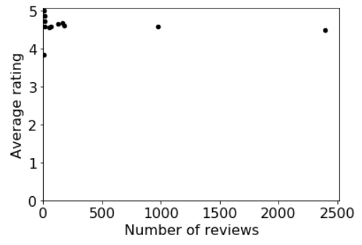
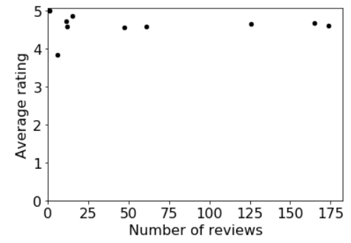
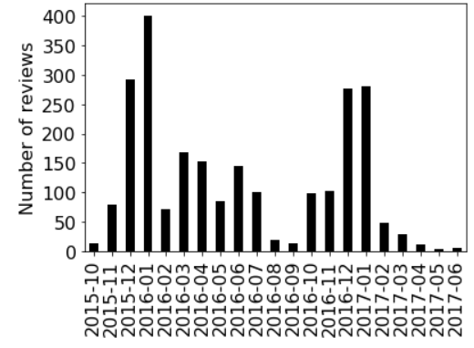
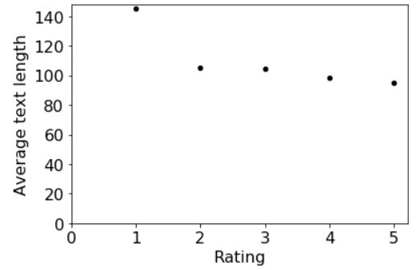
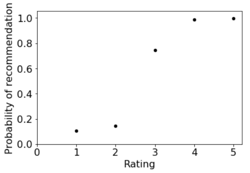

# Stage 2 (don't start yet, work in progress!)

We'll now use the clean data from stage 1 to analyze the reviews of the Amazon products. We'll also write some code to recursively find and process
files nested inside multiple directories. To start, download and extract `broken_file.zip` in the same location of your notebook (you need to have the `broken_file` directory in the same directory as your `main.ipynb`)

**Note:** You'll learn about making scatter plots in lab 11, so please
  don't ask about how to do that until we've released that lab and
  you've had a chance to work through it.

#### Question 21: How many unique usernames appear in the dataset?

#### Question 22: Who are the top 30 **prolific** users in this dataset?

Find the users with most reviews. Answer with a `dict` that maps username to the number of reviews by that user.

#### Question 23: Who are the users whose comments have been found helpful at least five times?

Answer with a `dict` that maps username to the total number of times when other people found their reviews helpful.

#### Question 24: Find the average rating of each product.

Answer with a `dict` that maps the name of a product to its average rating across all reviews.

**Warning:** For the next seven questions, remember that `test.py` can only detect whether you have a plot or not. It cannot check if your plot is correct. If your plots are incorrect, you will lose points. Check your answers with the plots provided below.

#### Question 25: What is the relationship between the number of reviews and the average rating of a product?

Answer with a scatter plot showing all of the products. The x-axis should represent the number of reviews, and the y-axis should represent the average rating. It should look like this:

As you can see, there are two outliers on this graph with a very high number of reviews, that make it difficult to make out the other points on the graph.

#### Question 26: Remove the outliers from the last plot.

Your plot should look like this:

Do you see any interesting patterns here? Why do you think the products with the least number of reviews have the most variance in their average rating?

#### Question 27: Plot a bar graph of number of reviews of the product 'Fire Kids Edition Tablet, 7 Display, Wi-Fi, 16 GB, Pink Kid-Proof Case' across all the months.

The x-axis should represent a month (and year) and the y-axis should represent the number of reviews of the product from that month.

Your plot should look like this:  

#### Question 28: Plot a bar graph of number of reviews of the product 'Fire Tablet, 7 Display, Wi-Fi, 8 GB - Includes Special Offers, Magenta' across all the months.

Your plot should look like this:

Do you see any similarities between the two plots. Plot the same graph for other products and see if the patterns persist. Can you find explanations for them?

#### Question 29: What is the relationship between the rating and the average text length?

Answer with a scatter plot. The x-axis should represent the rating and the y-axis should represent the average text length of a review with that rating.

Hint: Now might be a good time to create a `bucketize` function to sort the reviews by a given category. Bucketizing the reviews by their rating would be useful here.

Your plot should look like this:

Using this plot, can you infer the rating of a review given its text length? See if this pattern holds for title length as well. If not, look at the data and try to you explain why.

#### Question 30: What is the relationship between the rating and the likelihood of the review being helpful?

Answer with a scatter plot. The x-axis should represent the rating and the y-axis should represent the percentage of reviews that were found helpful by at least one person.

Your plot should look like this:

What ratings are the most helpful and what ratings are the least helpful? Why could that be?

#### Question 31: What is the relationship between the rating and the likelihood of the product being recommended?

Answer with a scatter plot. The x-axis should represent the rating and the y-axis should represent the percentage of reviews that recommended the product.

Your plot should look like this:

Can you explain why the graph isn't more linear?

#### Question 32: Which words appear most commonly in the text of reviews with rating 5. List only the words that appear more than 1000 times.

For simplicity, you can use `txt.lower().split(" ")` to get the words from a string `txt` (this counts punctuation as part of a word, which is not ideal, but won't affect the results to greatly).

Answer with a `list` of words sorted in decreasing order of the number of times they appear in the review text.

Is this data meaningful? Can you think of ways of extracting useful information about the mood of the reviewer from the words in the review text?

#### Question 33: Which words appear most commonly in the title of reviews with rating 5. List only the words that appear more than 100 times.

Answer with a `list` of words sorted in decreasing order of the number of times they appear in the review title.

Can you infer anything about the mood of the reviewers who rate products highly? Why couldn't you get this information from the review text so easily?

#### Question 34: Which words appear most commonly in the title of reviews with rating 1. List only the words that appear more than once.

Answer with a `list` of words sorted in decreasing order of the number of times they appear in the review title.

Do you notice any differences between the two dictionaries? Can you try to find the words that appear most commonly in the title of reviews with other ratings? Do you notice any patterns?

----
Now, we have some good news! The data from the JSON file that was broken(`review4.json`) has been found! Unfortunately, the data is not stored in a single JSON file. It has instead been broken down into multiple files and stored inside the directory `broken_file`. Explore this directory using Finder or Explorer to see how the data is stored there.

Write a function that takes a directory path as a parameter,
recursively explores that directory for any files (which might be
buried in many levels of sub directories), and finally returns a list
of paths to files inside that directory. The paths should be sorted
in *reverse-alphabetical order*. Exclude any files with names beginning
with `.`.

**Important:** there are Python functions that can do this for you
  (for example, https://docs.python.org/3/library/os.html#os.walk),
  but you need to write the recursive code for yourself.  If you use
  one of these existing implementations, we'll deduct any points you
  get for the remaining questions.

Your function MAY use the following:
* `os.listdir`
* `os.path.join`
* `os.path.isfile`
* `os.path.isdir`

Use your function to answer the following.

----

#### Question 35: List the paths in the `helpful` directory of the `rating5` directory.

#### Question 36: List the paths of all the files in the `rating4` directory.

List the paths of the files inside the directory, as well as the paths of all files inside any sub-directories.

#### Question 37: List the paths of all the files in the `broken_file` directory.

List the paths of the files inside the directory, as well as the paths of all files inside any sub-directories.

#### Question 38: Combine all the files in `broken_file` and find the number of unique products being reviewed in these files.

#### Question 39: Combine all the files in the directories `data` and `broken_file`, and find the total number of reviews.

Remember that you have to ignore data that you cannot parse.

#### Question 40: What is the percentage of change in the average rating changed for the product 'Fire Tablet, 7 Display, Wi-Fi, 8 GB - Includes Special Offers, Magenta', because of the addition of the new data?
