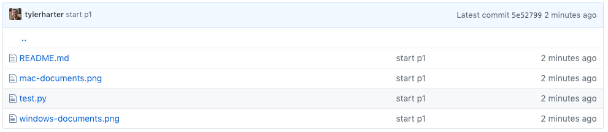
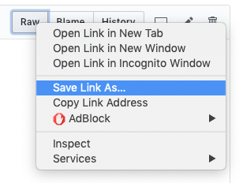

# Project 1

Much of challenge of programming involves setting up your computer
properly and learning how to use various tools.  This project (worth
1% of your course grade) is designed to walk you through how to
download project files, create a Python notebook, run tests, and turn
in your project.  We assume you're either using a lab machine, or
you've downloaded [Anaconda 3.7](https://www.anaconda.com/download) on
your personal computer.

In subsequent projects, you'll need to very carefully follow [course
policy](https://tyler.caraza-harter.com/cs301/spring19/syllabus.html)
to avoid academic misconduct, but for this project, we just want to
walk everybody through the process.  So feel free to get any kind of
help from anybody (fellow students or otherwise) for P1.

## Step 1: Download Project Files

The first thing you're going to need to decide is where to keep your
project work this semester.  If you don't have a preference, we
recommend creating a folder named "cs301" under "Documents".  How to
find the Documents folder may vary from computer to computer.  On a
Windows machine, you might find it like this in File Explorer:

On a Mac, you might find it in Finder here:

Inside the new "cs301" folder you created under "Documents", we
recommend you create a sub-folder called "p1" and use it for all your
files related to this project.  This way, you can keep files for
different projects separate (you'll create a "p2" sub-folder for the
next project and so on).

Next, you will need to download the files we specify to your project
folder.  In this case, you will just download "test.py" to your "p1"
folder.  First, locate the file you want (test.py) at the top of the
project document.  You'll see a list of files, something like this:

Downloading files from GitHub (the site hosting this document) is a
little tricky for those new to it.  Follow these steps carefull:

1. LEFT-CLICK on "test.py"
2. RIGHT-CLICK on the "Raw" button
3. Choose "Save Link As..." (or similar)
4. Save the file in your "p1" folder

We recommend you use the Chrome browser (other browsers will work too,
but sometimes we've seen Safari automatically renaming files when
downloaded, which is usually problematic).  In Chrome, right-clicking
the "Raw" button looks like this:

## Step 2: Create a Python Notebook

## Step 3: Copy/Paste Code

## Step 4: Run the Tests

## Step 5: Hand in the Project
