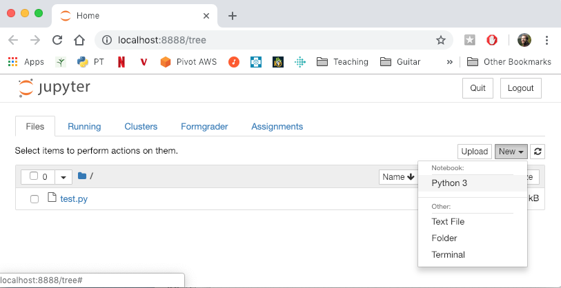
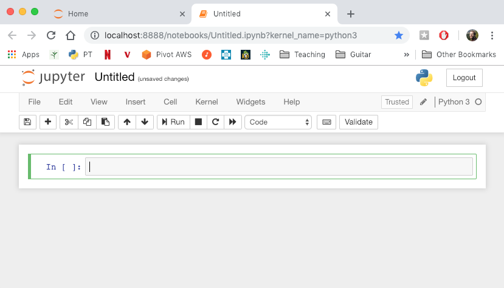

# Project 1

Much of challenge of programming involves setting up your computer
properly and learning how to use various tools.  This project (worth
1% of your course grade) is designed to walk you through how to
download project files, create a Python notebook, run tests, and turn
in your project.  We assume you're either using a lab machine, or
you've downloaded [Anaconda 3.7](https://www.anaconda.com/download) on
your personal computer.

In subsequent projects, you'll need to very carefully follow [course
policy](https://tyler.caraza-harter.com/cs301/spring19/syllabus.html)
to avoid academic misconduct, but for this project, we just want to
walk everybody through the process.  So feel free to get any kind of
help from anybody (fellow students or otherwise) for P1.

## Step 1: Download Project Files

The first thing you're going to need to decide is where to keep your
project work this semester.  If you don't have a preference, we
recommend creating a folder named "cs301" under "Documents".  How to
find the Documents folder may vary from computer to computer.  On a
Windows machine, you might find it like this in File Explorer:


On a Mac, you might find it in Finder here:


Inside the new "cs301" folder you created under "Documents", we
recommend you create a sub-folder called "p1" and use it for all your
files related to this project.  This way, you can keep files for
different projects separate (you'll create a "p2" sub-folder for the
next project and so on).

Next, you will need to download the files we specify to your project
folder.  In this case, you will just download "test.py" to your "p1"
folder.  First, locate the file you want (test.py) at the top of the
project document.  You'll see a list of files, something like this:


Downloading files from GitHub (the site hosting this document) is a
little tricky for those new to it.  Follow these steps carefull:

1. left-click on "test.py"
2. right-click on the "Raw" button
3. Choose "Save Link As..." (or similar)
4. Save the file in your "p1" folder

We recommend you use the Chrome browser (other browsers will work too,
but sometimes we've seen Safari automatically renaming files when
downloaded, which is usually problematic).  In Chrome, right-clicking
the "Raw" button looks like this:


## Step 2: Create a Python Notebook

Now it gets a little tricky.  You need to figure out the path of your
"p1" folder.  You can think of a "path" is just a more complete name
for a file or folder.  This is useful: if I have more than one "p1"
folder on my computer, how do you communicate which one?  You need a
full pathname, something like "/Users/harter/Documents/cs301/p1" (Mac)
or "C:\Users\harter\Documents\cs301\p1" (Windows).  The pathname of
"p1" may be slightly different on your computer, but you can figure it
out with these steps:

1. open your "Documents" in either File Explorer or Finder
2. copy the pathname of "p1" using either these [Windows directions](https://www.pcworld.com/article/251406/windows_tips_copy_a_file_path_show_or_hide_extensions.html) or [Mac directions](http://osxdaily.com/2015/11/05/copy-file-path-name-text-mac-os-x-finder/)
3. paste the pathname of "p1" in your notes somewhere

Now we want to create something called a "notebook" in your "p1"
folder.  To do so, you'll need to open something called a "terminal
emulator".

**Mac**:
1. open Finder
2. click "Applications"
3. open "Utilities"
4. double-click Terminal.app

**Windows**:
1. hit the Windows logo key on your keyboard
2. click "Windows PowerShell" (be careful, DO NOT choose the ones that say "ISE" or "x86")

Ok, now the directions are the same for Mac and Windows again.  Type
this in the terminal (replace P1-PATH with the pathname of "p1", as
you determined above; keep the quotes around the pathname, though) and
hit enter:

```
cd "P1-PATH"
```

Type "ls" and hit enter.  If you've done everything correctly so far,
you should see the "test.py" file that you downloaded in step 1
listed.

Now, type "jupyter notebook" and hit enter.  This should open up
Jupyter as a web page in your web browser.  If this doesn't work,
Anaconda probably wasn't installed properly.  If have this problem but
you think you installed Anaconda, please bring your laptop to
someone's office hours for help -- there are probably some tricky
configuration issues remaining.

If everything works properly, you'll see something like this (notice
you can still see the test.py file in Jupyter):



Click "New", then "Python 3".  A new tab like this should open:



## Step 3: Copy/Paste Code

## Step 4: Run the Tests

## Step 5: Hand in the Project
