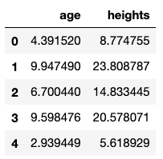
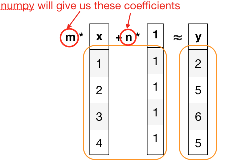
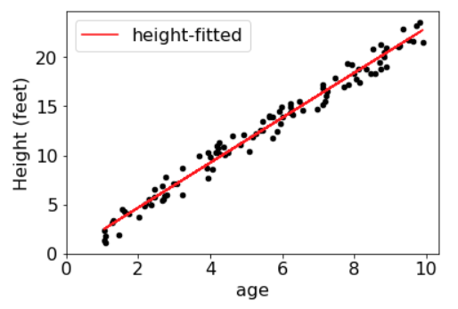

# Lab 13: Fit Lines

In this lab, you'll learn three things:

1. how to draw a fit line
2. what numpy is, and its relationship to pandas
3. how to compute a fit line

## Drawing a Fit

Scatter plots are a good way to visualization correlations.  We'll
often want to overlay the scattered points with a line to represent
the approximate relationship.  This can help us see the pattern
underlying the noise.

Let's construct a DataFrame with two related columns: tree age and
tree height.  We'll randomly generate data.  Let's imagine that
`height ≈ age * 2.3` (or `height = age * 2.3 + NOISE`) and randomly
generate some data.  Complete and run the following to generate 100
random trees:

```python
import random

ages = []
heights = []
for i in range(????):
    age = random.uniform(1, 10)
    noise = random.uniform(-1.5, 1.5)
    height = age * 2.3 + noise
    ages.append(age)
    heights.append(????)

trees = DataFrame({"age":ages, ????:heights})
trees.head()
```

The above code has some randomness, so you'll get different numbers
each time you run it, but it should look something like this:



Complete the following to plot a scatter of the data:

```python
# tree scatter
import matplotlib
matplotlib.rcParams["font.size"] = ????

ax = trees.plot.????(x="age", y="heights", c=????, xlim=0, ylim=0)
ax.set_xlabel(????)
ax.????("Height (feet)")
```

Fill in the `????` parts to get a plot that looks something this:


If we want to draw a fit line, we need to add some fitted height
values to match the age values we already have in a DataFrame.
Let's use a slope of 2.

```python
trees["height-fitted"] = trees["age"] * 2
trees.head()
```

It should look something like this:


Notice there's some difference between `height` and `height-fitted`.
The former are the actual values; the latter is what height would be
if height were always twice age, with no noise.  Let's plot the fit
line on top of our scatter:

```python
# tree scatter
import matplotlib
matplotlib.rcParams["font.size"] = ????

ax = trees.plot.????(x="age", y="heights", c=????, xlim=0, ylim=0)
ax.set_xlabel(????)
ax.????("Height (feet)")

trees.plot.line(ax=ax, x="age", y="height-fitted", color="red")
```

Note that the above cell is the same as the earlier example, with the
addition of just the `trees.plot.line` line at the end, so you could
copy from earlier rather than fill in all the `????` parts.  It should
look like this:


So drawing a fit line is easy.  Of course, we just made up the slope.
We need to do some *linear algebra* to compute the slope and intercept
in a meaningful way.  We'll use the `numpy` module for this.

## Numpy

Numpy is the most popular way to represent matrices in Python and do
linear algebra.  Import it:

```python
import numpy as np
```

The main data structure in numpy is the array; it is used to represent
vectors and matrices.  Try creating one:

```python
np.array([1,2,3,4,5,6,7,8])
```

To create a matrix, you can start with a vector, then impose some
structure on it with a call to `.reshape(ROWS, COLS)`.

Create a matrix with 2 rows and 4 columns:

```python
matrix = np.array([1,2,3,4,5,6,7,8]).reshape(2, 4)
matrix
```

Now create a matrix with 4 rows and 2 columns:

```python
matrix = np.array([1,2,3,4,5,6,7,8]).reshape(4, 2)
matrix
```

The output of the above looks like this:

```
array([[1, 2],
       [3, 4],
       [5, 6],
       [7, 8]])
```

As you can see, a numpy array looks like a list of lists; indeed, you
can access it as such (the following gets 7):

```python
matrix[3][0]
```

Complete the following to get `6` from `matrix`:

```python
matrix[????][????]
```

Pandas is closely integrated with numpy, so it is easy to convert a
Pandas DataFrame to a numpy array, using the `.values` attribute.  Try
it:

```python
trees.values
```

You should see something like this:

```
array([[ 4.74371708, 12.00074986,  9.48743415],
       [ 9.29054235, 20.08030328, 18.58108469],
       [ 6.01233576, 13.31622645, 12.02467151],
       [ 3.97135042,  8.41919774,  7.94270085],
       [ 4.13624753,  8.87260787,  8.27249507],
       [ 4.02866154,  8.24494275,  8.05732308],
       [ 1.92147542,  5.71251348,  3.84295085],
       [ 7.36679907, 18.38501823, 14.73359814],
       [ 4.74236776,  9.74468899,  9.48473553],
       ...
       [ 2.6725559 ,  6.03215439,  5.3451118 ]])
```

## Computing a Fit

We'll use something called the *Least Squares Method* to find a fit
line for our trees data (https://en.wikipedia.org/wiki/Least_squares).
For CS 301, you only need to understand it at an intuitive level.
Imagine we attached a movable line to every point in our data, as in
the following:


The line will naturally settle so as to minimize the total tension in
all the strings.  Imagine that the tension in a spring is the square
of the distance the spring is stretched (e.g., stretching a spring
twice as far increases the tension in that spring by 4 times).

Rather than get into the math of computing how the line will settle,
we'll use the `np.linalg.lstsq(...)` function in numpy.

To setup the problem, imagine that we want to find some coefficients
to get an approximate formula that relates some of the columns in a
DataFrame.  For a simple `y = m*x + n` line, the relationship on the
DataFrame might look like this:



Note that the coefficients (even the one for the line's intercept)
need to be multiplied by a column (that's just what the `lstsq`
function expects), so we have a dummy column containing just ones for
`n`.  As you can see, we're trying to relate the `y` column Series (an
output) to a `DataFrame` of values (the inputs) from which we want to
estimate `y`.

Let's add the dummy column to our `trees` DataFrame and pull out the
inputs and output:

```python
output = trees["heights"]
trees["one"] = 1
inputs = trees[["age", "one"]]
inputs.head()
```

If we have a DataFrame `df`, then `df[list_of_columns]` will create a
DataFrame that has a subset of the original columns (as specified in
the list), so `inputs` will look something like this (`age` is the
`x` in this case):


Ok, now we're ready to crunch some numbers:

```python
result = np.linalg.lstsq(inputs, output, rcond=None)
result
```

Notice we're passing our `inputs` DataFrame and `output` Series; numpy
can work with these Pandas types.  The `rcond=None` is an unimportant
detail (you should always pass that).  `result` will look something
like this:

```
(array([2.27595611, 0.10250293]),
 array([80.70169711]),
 2,
 array([64.20719236,  3.56646379]))
```

Notice it's a tuple with four values, as described here:
https://docs.scipy.org/doc/numpy/reference/generated/numpy.linalg.lstsq.html.
According to the documentation, the tuple is like this:
`(coefficients, residuals, rank, singular_values)`.  Here, we only
care about the coefficients, so let's pull those out:

```python
slope = result[0][0]
intercept = result[0][1]
slope, intercept
```

Let's use this slope and intercept to fill in the `height-fitted` column correctly now:

```python
trees["height-fitted"] = trees["age"] * slope + intercept
trees.head()
```

Let's conclude by re-plotting the scatter data and fit line:

```python
import matplotlib
matplotlib.rcParams["font.size"] = 16

ax = trees.plot.scatter(x="age", y="heights", c="black", xlim=0, ylim=0)
ax.set_xlabel("Age (years)")
ax.set_ylabel("Height (feet)")

trees.plot.line(ax=ax, x="age", y="height-fitted", color="red")
```


