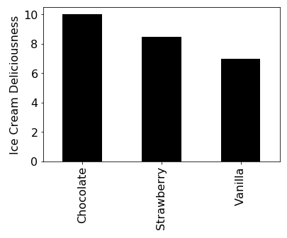

# Lab 9: Project 8, Stage 2

In this lab, you'll learn to create simple plots using dictionaries,
decode a secret message, recurse, and take your sorting to the next
level.  Have fun!

## Package Installation

For this lab, you'll need to use two new packages: `matplotlib` and
`pandas`.  We'll eventually learn a lot about these, but for now you
just need to install them and call some functions we provide.  These
and many other Python packages are available on the [PyPI site](https://pypi.org/).

Once you know the name of a Python package, installing it is easy.  You just
run the following in the terminal, substituting in the package name:

```
pip install ????
```

So in this case, you should run the following (in either the Mac
Terminal or Windows PowerShell):

```
pip install matplotlib
pip install pandas
```

If you're on the lab machines, the above will fail because these will
already be installed, and you are not allowed to make changes.  You
may also many "Requirement already satisfied" messages (e.g., if you
already installed these by following the setup videos we provided at
the beginning of the semester), so don't be surprised if your output
looks something like this:

```
Requirement already satisfied: pandas in /Library/Frameworks/Python.framework/Versions/3.7/lib/python3.7/site-packages (0.23.4)
Requirement already satisfied: python-dateutil>=2.5.0 in /Library/Frameworks/Python.framework/Versions/3.7/lib/python3.7/site-packages (from pandas) (2.7.5)
Requirement already satisfied: numpy>=1.9.0 in /Library/Frameworks/Python.framework/Versions/3.7/lib/python3.7/site-packages (from pandas) (1.16.0)
Requirement already satisfied: pytz>=2011k in /Library/Frameworks/Python.framework/Versions/3.7/lib/python3.7/site-packages (from pandas) (2018.9)
Requirement already satisfied: six>=1.5 in /Library/Frameworks/Python.framework/Versions/3.7/lib/python3.7/site-packages (from python-dateutil>=2.5.0->pandas) (1.12.0)
You are using pip version 19.0.1, however version 19.0.3 is available.
You should consider upgrading via the 'pip install --upgrade pip' command.
```

Common issues:
* if you have both Python 2 and 3 installed, you may need to replace `pip` with `pip3`
* if neither pip command is found, you may need to replace `pip` with `python -m pip` or `python3 -m pip`.  This just means pip, although installed, is not on the PATH (i.e., your computer doesn't know where to find it)

## Plotting Dictionaries

Creating a dictionary will often be the first step towards creating a
bar plot in Python.  In particular, each dictionary key might
correspond to a category (along the x-axis) and each value might
correspond to an amount (along the y-axis).  To setup plotting in
Python, paste following into two separate cells (with no other code
added):

```python
%matplotlib inline
```

And in a second cell:

```python
import matplotlib, pandas

def plot_dict(d, label="Please Label Me!!!"):
    ax = pandas.Series(d).sort_index().plot.bar(color="black", fontsize=16)
    ax.set_ylabel(label, fontsize=16)
```

Let's try creating a simple dictionary and using it to create a bar plot with the `plot_dict` function:

```python
scores = {"Dogs": 9.9, "Cats": 4.1, "Humans": 8.7}
plot_dict(scores)
```

You should see something like the following:


Notice that the y-axis is missing a label; that can be specified with
an optional second argument.  Try specifying something descriptive,
like this, and observe the result:

```python
scores = {"Dogs": 9.9, "Cats": 4.1, "Humans": 8.7}
plot_dict(scores, "Likeability")
```

Now try writing a couple lines of code to produce a plot using
`plot_dict` that looks roughly like the following (feel free to use
different numbers to reflect your personal preferences):



## The Gold Bug

*The Gold Bug* is a famous story by Edgar Allan Poe about cracking a
 secret message by counting how often different symbols occur.  Take a
 moment to skim the Wikipedia article if you aren't familiar with the story:
https://en.wikipedia.org/wiki/The_Gold-Bug

The secret message in the story is the following:

```
53‡‡†305))6*;4826)4‡.)4‡);806*;48†8
¶60))85;;]8*;:‡*8†83(88)5*†;46(;88*96
*?;8)*‡(;485);5*†2:*‡(;4956*2(5*—4)8
¶8*;4069285);)6†8)4‡‡;1(‡9;48081;8:8‡
1;48†85;4)485†528806*81(‡9;48;(88;4
(‡?34;48)4‡;161;:188;‡?;
```

Complete the following code to produce a plot that shows the frequency
of each letter:

```python
lines = [
    '53‡‡†305))6*;4826)4‡.)4‡);806*;48†8',
    '¶60))85;;]8*;:‡*8†83(88)5*†;46(;88*96',
    '*?;8)*‡(;485);5*†2:*‡(;4956*2(5*—4)8',
    '¶8*;4069285);)6†8)4‡‡;1(‡9;48081;8:8‡',
    '1;48†85;4)485†528806*81(‡9;48;(88;4',
    '(‡?34;48)4‡;161;:188;‡?;',
]

# key is the symbol, value is how many times it occurred
counts = {}

for line in ????:
    for symbol in line:
        if not symbol in counts:
            counts[????] = 0
        counts[????] += 1

plot_dict(????, "Occurrences")
```

The most common letter in English is "e".  Based on your plot, can you
guess which symbol represents the letter "e"?

**Bonus:** improve the above code so that the y-axis shows percentage
of symbols rather than a raw count.  For example, the plot should
communicate that "8" represents 16% of the symbols rather merely
reporting that "8" occurs 34 times.  *Disclaimer: the "bonus" above
mentioned refers to the fun and satisfaction you'll obtain by doing
this exercise, rather than any actual accounting of points.*

## Binning

Start by pasting the following code in a cell to setup the data:

names = ["Ada", "Caitlin", "Abe", "Bobby", "Alice", "Britney", "Cindy", "Caleb"]

Your job is to determine, for each letter, the average length of names
starting with that letter.  This is a two-part task: (1) bucketize the
names based on the first letter, and (2) run a function over each
bucket of data to get a summary.

### Step 1: Bucketize

Try completing the following:

```python
buckets = {}

for name in names:
    first = name[????]
    if not first in ????:
        buckets[first] = [] # empty list
    buckets[????].append(????)

buckets
```

If you complete the above correctly, `buckets` will contain the following dict of lists:

```python
{'A': ['Ada', 'Abe', 'Alice'],
 'C': ['Caitlin', 'Cindy', 'Caleb'],
 'B': ['Bobby', 'Britney']}
```

### Step 2: Stats per Bucket

Now complete the following:

```python
def avg_len(names):
    total = 0
    for name in names:
        ???? += len(name)
    return total / len(????)

summary = {}
for k in buckets:
    summary[k] = avg_len(buckets[????])

summary
```

Your goal is for `summary` to be a dictionary where a key is the first
letter of a name, and the corresponding value is the average length of
the names starting with that letter, like this:

```python
{'A': 3.6666666666666665, 'C': 5.666666666666667, 'B': 6.0}
```

Try visualizing your result:

```python
plot_dict(summary, "Avg Name Length")
```

## Recursion


## Function References

Note, if you're working ahead on this lab because you're bored during
spring break, you may wish to leave these last couple sections until
we've covered function references in class.

## Sorting

