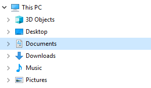

# Project 1

Much of challenge of programming involves setting up your computer
properly and learning how to use various tools.  This project (worth
1% of your course grade) is designed to walk you through how to
download project files, create a Python notebook, run tests, and turn
in your project.  We assume you're either using a lab machine, or
you've followed our instructions for [setting up your own
computer](https://tyler.caraza-harter.com/cs301/spring19/videos.html).

In subsequent projects, you'll need to very carefully follow [course
policy](https://tyler.caraza-harter.com/cs301/spring19/syllabus.html)
to avoid academic misconduct, but for this project, we just want to
walk everybody through the process.  So feel free to get any kind of
help from anybody (fellow students or otherwise) for P1.

## Step 1: Download Project Files

The first thing you're going to need to decide is where to keep your
project work this semester.  If you don't have a preference, we
recommend creating a folder named `cs301` under `Documents`.  How to
find the Documents folder may vary from computer to computer.  On a
Windows machine, you might find it like this in File Explorer:



On a Mac, you might find it in Finder here:


Inside the new `cs301` folder you created under `Documents`, we
recommend you create a sub-folder called `p1` and use it for all your
files related to this project.  This way, you can keep files for
different projects separate (you'll create a `p2` sub-folder for the
next project and so on).  Of course, computers crash and files get
accidentally deleted, so you should make sure you backup your work
regularly (at a minimum, consider emailing yourself relevant files on
occasion).

Next, you will need to download the files we specify to your project
folder.  In this case, you will just download `test.py` to your `p1`
folder.  First, locate the file you want (test.py) at the top of the
project document.  You'll see a list of files, something like this:


Downloading files from GitHub (the site hosting this document) is a
little tricky for those new to it.  Follow these steps carefull:

1. left-click on `test.py`
2. right-click on the "Raw" button
3. Choose "Save Link As..." (or similar)
4. Save the file in your `p1` folder

We recommend you use the Chrome browser (other browsers will work too,
but sometimes we've seen Safari automatically renaming files when
downloaded, which is usually problematic).  In Chrome, right-clicking
the "Raw" button looks like this:


## Step 2: Create a Python Notebook

Now it gets a little tricky.  You need to figure out the path of your
`p1` folder.  You can think of a "path" is just a more complete name
for a file or folder.  This is useful: if I have more than one `p1`
folder on my computer, how do you communicate which one?  You need a
full pathname, something like `/Users/harter/Documents/cs301/p1` (Mac)
or `C:\Users\harter\Documents\cs301\p1` (Windows).  The pathname of
`p1` may be slightly different on your computer, but you can figure it
out with these steps:

1. open your `Documents` in either File Explorer or Finder
2. copy the pathname of `p1` using either these [Windows directions](https://www.pcworld.com/article/251406/windows_tips_copy_a_file_path_show_or_hide_extensions.html) or [Mac directions](http://osxdaily.com/2015/11/05/copy-file-path-name-text-mac-os-x-finder/)
3. paste the pathname of `p1` in your notes somewhere

Now we want to create something called a "notebook" in your `p1`
folder.  To do so, you'll need to open something called a "terminal
emulator".

**Mac**:
1. open Finder
2. click "Applications"
3. open "Utilities"
4. double-click Terminal.app

**Windows**:
1. hit the Windows logo key on your keyboard
2. type `powershell`
3. open "Windows PowerShell" (be careful, DO NOT choose the ones that say "ISE" or "x86")

Ok, now the directions are the same for Mac and Windows again.  Type
this in the terminal (replace P1-PATH with the pathname of `p1`, as
you determined above; keep the quotes around the pathname, though) and
hit enter:

```
cd "P1-PATH"
```

Type `ls` and hit enter.  If you've done everything correctly so far,
you should see the `test.py` file that you downloaded in step 1
listed.

Now, type `jupyter notebook` and hit enter.  This should open up
Jupyter as a web page in your web browser.  If this doesn't work, your
computer probably wasn't setup properly.  If you have already tried
[our directions](https://tyler.caraza-harter.com/cs301/spring19/videos.html), please bring your laptop to someone's office hours for
help -- there are probably some tricky configuration issues remaining.

**Note:** even though we'll be working in the web browser now, NEVER
  close the terminal window where you typed `jupyter notebook` until
  your done -- if you do, you'll probably lose any unsaved work.

If everything works properly, you'll see something like this (notice
you can still see the test.py file in Jupyter):


Click "New", then "Python 3".  A new tab like this should open:


Notice how it says "Untitled" at the top?  Click that word, type a new
name for the notebook, then click "Rename".  We recommend you name
your notebook "main".  Now, if you go back to File Explorer or Finder
and open the `p1` folder, you should see a file named `main.ipynb`
(though the extension of ".ipynb" may be hidden depending on your
computer).  This is the file you'll hand in at the end.

## Step 3: Copy/Paste Code

Now you're going to run some Python code.  We don't expect you to
write your own code for this project yet, so you'll just copy/paste
what we provide.

In the box adjacent to `In [ ]`, paste the following:

```
#q1
name = "World"
"Hello " + name
```

Then hit SHIFT-ENTER on the keyboard (this means you should first
press and hold down the SHIFT key, then press the ENTER key at the
same time).  There should now be an `Out [1]` area saying this:

```
'Hello World'
```

A new input box (called a "cell") will also have been created
automatically for you.  Let's paste this in that cell:

```
#q2
6*7
```

Hit SHIFT-ENTER again to run it, and you'll see an output of `42`.

At this point, your notebook should look like this:


Let's paste and run one more cell:

```
"oops"
```

What if you want to delete that last cell?  Try clicking in the cell
where you typed "oops".  Then hit the ESCAPE key on your keyboard.
Notice how the cell border changes from green to blue?  That means the
notebook is in command mode, so whatever you type will trigger
commands (instead of adding text to the box).  Hit the "d" key twice,
and see how the cell gets deleted.  This will be handy whenever you
make a mistake or want to delete your scratch work.

## Step 4: Run the Tests

Remember the test.py file we asked you to download?  That file is a
Python program that you can run to check whether your notebook looks
correct before you turn it in.  Here are the steps to use it:

1. in your notebook, click "Kernel" from the menu, then click "Restart & Run All"
2. confirm "Restart & Run All Cells"
3. click "File" from the menu (beneath the Jupyter logo), then click "Save and Checkpoint"
4. open a new terminal window, as you did in step 2 of this document (leave the previously opened one undisturbed)
5. type the same `cd "P1-PATH"` command in the terminal as before, again replacing `P1-PATH` with the pathname of `p1` in your notes, and hit ENTER
6. type `python test.py` and hit ENTER; if that doesn't work, try `python3 test.py`; if that still doesn't work, please get help during office hours.

If everything is setup properly and your notebook is correct, you'll see something like this:

```
[NbConvertApp] Converting notebook main.ipynb to notebook
[NbConvertApp] Executing notebook with kernel: python3
[NbConvertApp] Writing 1211 bytes to cs-301-test.ipynb
Checking 1
Checking 2
{
  "score": 100.0,
  "tests": [
    {
      "test": 1,
      "result": "PASS",
      "weight": 1
    },
    {
      "test": 2,
      "result": "PASS",
      "weight": 1
    }
  ]
}
TOTAL SCORE: 100.00
```

The only thing you need to care about for now is that last line:
`100.00` means you're passing 100% of the tests.

In general, for tests to be helpful, make sure you alway do the
"Restart & Run All Cells" and "Save and Checkpoint" steps described
above.

## Step 5: Hand in the Project

Before you can hand in the project, you need to add a few more
details.  Paste the following in a new cell:

```python
# project: p1
# submitter-netid: NETID1
# partner-netid: NETID2
```

Replace `NETID1` with your Net ID (the part before "@wisc.edu" in your
student email address).  If you worked with a partner, replace
`NETID2` with your partner's Net ID; otherwise, replace NETID2 with
"none".

If you worked with with a partner, there should only be one submission
between you (please don't both submit), and make sure that
`submitter-netid` refers to the one actually submitting the code (not
the other partner).

To hand in the notebook, complete the following steps:

1. run through the tests one last time (after you added your Net ID info)
2. go to [https://tyler.caraza-harter.com/cs301/spring19/submission.html](https://tyler.caraza-harter.com/cs301/spring19/submission.html)
3. select "Project 1"
4. click "Choose File" and find your main.ipynb file
5. click "Submit"
6. click "Check Code Review" to make sure your submission looks correct

Congrats on finishing your first CS 301 project!
