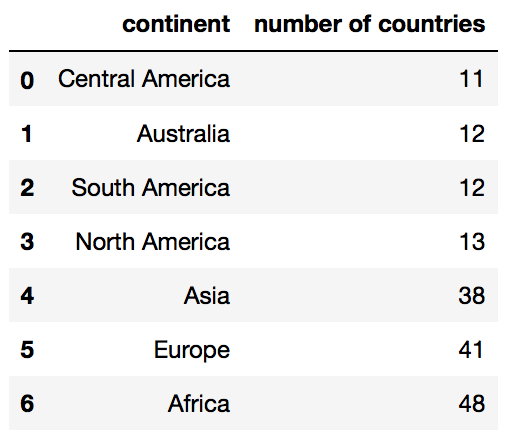
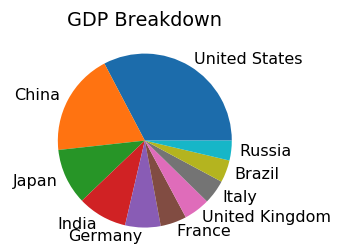
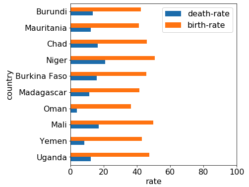
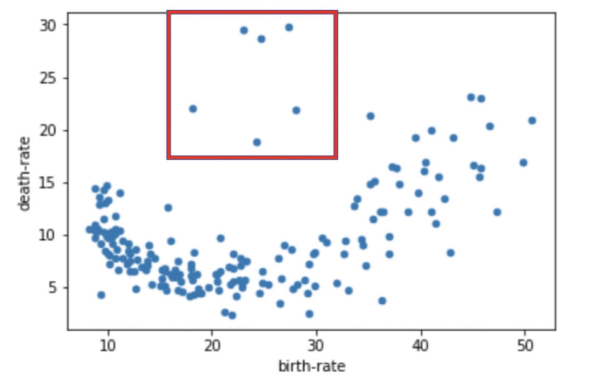
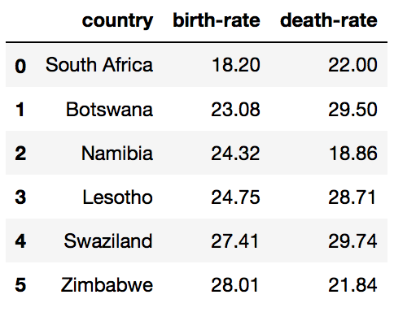
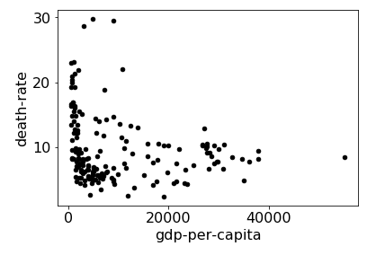

# Stage 2: Database Queries and Plotting

In this section, you'll dump your DataFrames to a SQLite database.
You'll answer questions by doing queries on that database.  Often,
your answer will be in the form of a plot.  Check these carefully, as
the tests only verify a plot has been created, not that it looks
correct (TAs will manually deduct points for plotting mistakes).

Create your database by pasting the following cell to your notebook.

```python
import sqlite3
conn = sqlite3.connect('countries.db')
countries_df.to_sql("countries", conn, if_exists="replace", index=False)
capitals_df.to_sql("capitals", conn, if_exists="replace", index=False)

# remember to do conn.close() at the end of your notebook
```

If you named your DataFrames something other than `countries_df` and
`capitals_df`, tweak the above code to use your variable names.

#### Question 21: how many countries are in each continent?

Look at the `Question 21` table in `expected.html`.  Your answer
should be a DataFrame with the same rows and columns.  It should look
like this:



Requirements:
* use a GROUP BY query in SQL
* sort by number of countries (least first)
* break ties alphabetically ("A" before "B", etc)
* the column names should be `continent` and `number of countries`

Use backtics (`` ` ``) around column names with spaces to satisfy the
last requirement.  You should also use the backtics to deal with
column names containing other problematic characters as well (e.g.,
`-`).

#### Question 22: how many countries are in each continent?  (answer with a plot)

Answer with a **bar plot**.  Put continents on the x-axis and number
of countries on the y-axis.  The continents should be sorted along the
x-axis in ascending order by the number of countries and then alphabetically by name.

**Expected output:**


#### Question 23: what is the total population of each continent?

For this question, you should calculate the total population of every continent
and display the `continent` name and total population of the continent (using a
column named `total population (million)`). The results should be displayed in *descending* order of the
column `total population (million)`.

**Expected output:**


#### Question 24: what is the total population of each continent? (answer with a plot)

Answer with a **bar plot**.  Put continents on the x-axis and total
populations on the y-axis.  The continents should be sorted along the
x-axis in *descending* order of total population.

**Expected output:**


#### Question 25: what is the population of each country in Australia?

Australia has the smallest population among all continents, let's find out what is the population of each country in this continent. You should display the `country` name and `population` of the countries. The results should be displayed in *descending* order of the column `population`.

**Expected output:**


#### Question 26: what are the top 10 countries that have the largest real GDP?

You should display the `country` name and `real GDP (billion)` of the top 10 countries that have the largest real GDP. These top 10 countries should be
displayed in *descending* order of real GDP.

Hint: `real GDP = population * gdp-per-capita`

**Expected output:**


#### Question 27: what are the top 10 countries that have the largest real GDP? (answer with a plot)

To make the problem more interesting, answer with a **pie chart**.

**Expected output:**



#### Question 28: what are the top 10 countries that have the largest gap between birth rate and death rate?

You should display the `country` name, `birth-rate`, and `death-rate` of the top 10 countries that have the largest gap between `birth-rate` and `death-rate`. These top 10 countries should be displayed in *descending* order of the gap.

Hint: Gap is defined as the difference between `birth-rate` and `death-rate`

**Expected output:**


#### Question 29: what are the top 10 countries that have the largest gap between birth rate and death rate? (answer with a plot)

Answer with a **horizontal bar plot**.  Put countries on the x-axis and `birth-rate` and `death-rate` on the y-axis.  The countries should be sorted along the x-axis in *descending* order of gap.

**Expected output:**



#### Question 30: what is the relationship between birth rates and death rates?  (answer with a plot)

Answer with a **scatter plot** with `birth-rate` on the x-axis and `death-rate` on the y-axis. Do you observe a pattern between birth rate and death rate?

**Expected output:**


#### Question 31: notice that six outliers? which countries are they?

These are the points:



Write a query with to grab rows corresponding roughly to that
rectangle to get the points.  In the output, `birth-rate` should be
sorted low to high.

**Expected output:**



#### Question 32: what is the correlation between birth rates and death rates?

If you have a DataFrame `df`, then calling `df.corr()` will present a table showing the Pearson correlation between every pair of columns in df. A correlation of 1 is the max (so, for example, every column is correlated perfectly with itself). A high correlation between columns X and Y means that large X values tend to coincide with large Y values and small X values tend to coincide with small Y values. In some of the questions, you'll observe negative correlations (-1 being the smallest). This means that large X values tend to coincide with small Y values and vice versa.

**Expected output:**

`0.40037782919521714`

#### Question 33: what is the relationship between infant mortality and birth rates?

Answer with a **scatter plot** with `infant-mortality` on the x-axis and `birth-rate` on the y-axis.

**Expected output:**


#### Question 34: what is the correlation between infant mortality and birth rates?

Does this correlation value coincide with the pattern you saw in question 33? Could you give an explanation why the correlation between infant mortality and birth rates is larger than the correlation between birth rates and death rates?

**Expected output:**

`0.8687265678031416`

#### Question 35: what is the relationship between GDP per capita and death rates?

Answer with a **scatter plot** with `gdp-per-capita` on the x-axis and `death-rate` on the y-axis.

**Expected output:**



#### Question 36: what is the correlation between GDP per capita and death rates?:
Does this, correlation value coincide with the pattern you saw in question 35? Could you give an interpretation of this correlation?

**Expected output:**

`-0.20995846867456752`

#### Question 37: what is the relationship between GDP per capita and birth rates?

Answer with a **scatter plot** with `gdp-per-capita` on the x-axis and `birth-rate` on the y-axis. Do you observe a pattern between GDP per capita and birth rates? It seems that there is a correlation between GDP per capita and inverse of birth rate, so let's plot a scatter plot for that.:

**Expected output:**


#### Question 38: what is the relationship between GDP per capita and the inverse of birth rates?

Answer with a **scatter plot** with `gdp-per-capita` on the x-axis and `inverse birth rate` on the y-axis.

Hint: `inverse birth rate` is defined as `1 / birth-rate`

**Expected output:**


#### Question 39: fit a `y = m * x + n` line to the scatter plot in question 38 using the least-squares method; what are the coefficients m and n?

For the regression line, first try copy/pasting this code into a notebook cell and running it to see what happens:

```python
import numpy as np

df = DataFrame({
    "x": [1,2,3,4],
    "y": [2,5,6,5]
})
df["1"] = 1

res = np.linalg.lstsq(df[["x", "1"]], df["y"], rcond=None)

# res is a tuple: (COEFFICIENTS, VALUE, VALUE, VALUE)
coefficients = res[0] # coefficients is (m,n:
m = coefficients[0] # slope
n = coefficients[1] # intercept
ax = df.plot.scatter(x='x', y='y')

df["fit"] = df["x"] * m + n
df.plot.line(x='x', y='fit', c='red', ax=ax)
```

Then adapt the above code so that it uses your DataFrame (instead of
df) and replaces "x" with `gdp-per-capita` and "y" with `inverse birth rate`. Answer with a **tuple** for coefficients `(m, n)`.:

**Expected output:**

`(1.8422394400496355e-06, 0.03903504364953538)`

#### Question 40: plot the regression line to the scatter plot

To visualize how well the regression line fit the scatter points, draw a fit line over the **scatter plot**.

**Expected output:**


