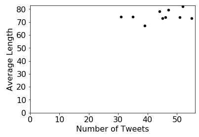
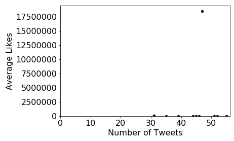
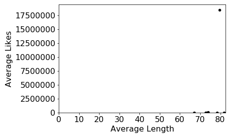

# Stage 2

We'll now use the clean data from stage 1 to analyze the tweets of a
few users.  We'll also write some code to recursively find and process
JSON nested inside multiple directories.  To start, do the following:

1. download and extract `recursive.zip` in the same location of your notebook (you need to have the `recursive` directory in the same directory as your `main.ipynb`)
2. re-download `test.py` to get all 40 tests

Through question 32, everything is about the data in `full_data`.  Use
your code from last time to answer the questions (this means you'll
ignore corrupt data, as in stage 1).

**Note:** you'll learn about making scatter plots in lab 11, so please
  don't ask about how to do that until we've released that lab and
  you've had a chance to work through it.

#### Question 21: How many tweets are present in total?

#### Question 22: Which usernames appear in the dateset?

Answer in the form of a `set`.

#### Question 23: How **prolific** is each user?

Answer with a `dict` that maps username to the number of tweets by that user.

#### Question 24: How **popular** is each user?

Answer with a `dict` that maps username to the average number of likes that user gets per tweet.

#### Question 25: How **verbose** is each user?

Answer with a `dict` that maps username to the average number of characters per tweet by that user.

#### Question 26: What is the relationship between number of tweets and length of tweets?

Answer with a scatter plot showing 10 points (one per user).  The
x-axis represents number of tweets, and the y-axis represents average
length.  It should look like this:

#### Question 27: What is the relationship between number of tweets and likes?

Answer with a scatter plot showing 10 points (one per user).  The
x-axis represents number of tweets, and the y-axis represents average
likes.  It should look like this:

#### Question 28: What is the relationship between length and likes?

Answer with a scatter plot showing 10 points (one per user).  The
x-axis represents average length, and the y-axis represents average
likes.  It should look like this:

#### Question 29: What is the username of the user represented by the outlier in the last two plots?

#### Question 30: What are the tweets made by that outlier user?

Answer with a list of Tweet objects, sorted by `num_liked` descending.

#### Question 31: What percent of the outlier user's total likes (across all tweets) come from the most-liked tweet?

#### Question 32: If we exclude that most-liked tweet, what is that user's like-per-tweet average?

----

Write a function that takes a directory path as a parameter,
recursively explores that directory for any files (which might be
buried in many levels of sub directories), and finally returns a list
of paths to files inside that directory.  The paths should be sorted
in reverse-alphabetical order.  Exclude any files with names beginning
with `.`.

**Important:** there are Python functions that can do this for you
  (for example, https://docs.python.org/3/library/os.html#os.walk),
  but you need to write the recursive code for yourself.  If you use
  one of these existing implementations, we'll deduct any points you
  get for the remaining questions.

Your function MAY use the following:
* `os.listdir`
* `os.path.join`
* `os.path.isfile`
* `os.path.isdir`

Use your function to answer the following.

----

#### Question 33: what are the files in the `rb9` directory of the `rb` directory of the `play` directory?

#### Question 34: what are the files in the `ls` directory of the `play` directory?

#### Question 35: what are the files in the `ou` directory of the `play` directory?

#### Question 36: what are the files in the `play` directory?

#### Question 35: what are the files in the `others` directory of the `recursive` directory?

#### Question 36: what are the files in the `recursive` directory?

#### Question 39: how many tweets are in the files in the `USERID_4` directory of the `recursive` directory?

#### Question 40: how many tweets are in the files in the `recursive` directory?
